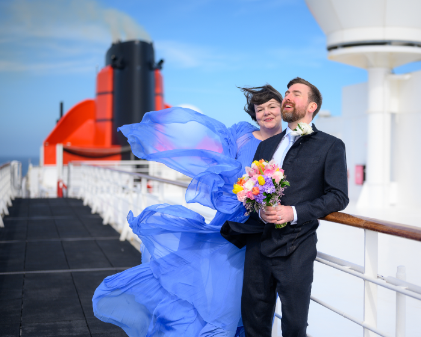

##### This is a set of pages about Sam and Tom's wedding. It happened on the Queen Mary II, [approximately halfway between the UK and the USA](./route.qmd). There is also a page of [photos](./photos.qmd).

{fig-alt="Sam and Tom are on the deck after their wedding. They look quite smug. Her dress blows dramatically in the wind. It was clearly very windy."}

I am trying to learn to use [Quarto](https://quarto.org), hence this is a bit clunky. Soz.